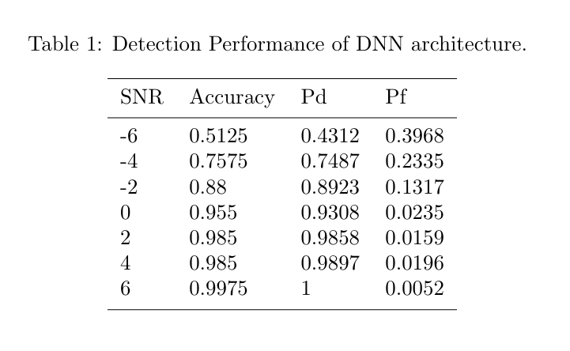
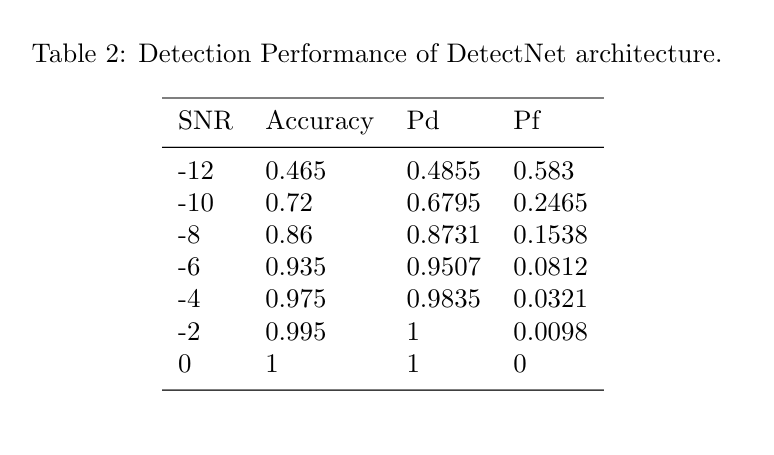

# DL-based-signal-detection - modified version by Psilym
Modified code for paper "Deep Learning Based Primary Signal Detection at Secondary User in Cognitive Radio Systems", IEEE WIRELESS COMMUNICATIONS LETTERS, VOL. 8, NO. 6, DECEMBER 2019.

## Experiment 

### Content and Description

As an experiment for "signal detection and estimation" class, we followed this paper and tried the source code published by the author (github link: [EricGJB](https://github.com/EricGJB/DL-based-signal-detection)). Based on the origin code, extra experiments were implemented as following:

-  In order to test the performance of deep learning models under low SNRs, we trained the models under different SNRs and tested the model with best generalization ability. 

**Note that** the origin paper used early stopping to control the false alarm rate $P_{fa}$ to be consistent following CFAR (Constant False-Alarm Rate). In our experiments, we tested the models without using early stopping, because we simply considered signal detection as a classification task and wanted to test the models with the best performance only.

### Dataset

The generation of dataset using **GNURadio** packages could be complicated due to Linux distribution version. Thus, we installed **Ubuntu 18.04 OS** on a virtual machine and using compiling from source method described in this [blog](https://blog.csdn.net/qq_45103492/article/details/108449519) (which may be helpful for Chinese reseachers).

Besides, an **error** was found in `generate_dataset.py` from the source code, which can be fixed as following: 

```python
#dataset[(mod_type.modname, snr)][modvec_indx,0,:] = np.real(sampled_vector) #line 55
#dataset[(mod_type.modname, snr)][modvec_indx,1,:] = np.imag(sampled_vector) 
dataset[(mod_type.modname, snr)][modvec_indx,0,:] = np.real(total_vector)
dataset[(mod_type.modname, snr)][modvec_indx,1,:] = np.imag(total_vector)
```

In order to help researchers try this dataset, we uploaded our dataset (with sample length = 64, SNR = -50 ~ 10 with step 2) on the [google drive](https://drive.google.com/file/d/1TnEeQ4XC_4vabu_9M1QmbTQoNIckk5SJ/view?usp=sharing).

Basically, the dataset generation follows the [source code of RadioML's generation](https://github.com/radioML/dataset).

### Train Models

The models were trained by using **tensorflow** with **one Nvida GeForce RTX 2070s GPU** on **Ubuntu 16.04 OS** (our workstation not virtual machine). The Tensorflow version is 2.2. Part of the packages of my anaconda environment is as following:

```bash
# Name                    Version                   Build  Channel
tensorflow                2.2.0           gpu_py36hf933387_0  
tensorflow-base           2.2.0           gpu_py36h8a81be8_0  
tensorflow-estimator      2.2.0              pyh208ff02_0  
tensorflow-gpu            2.2.0                h0d30ee6_0  
cudatoolkit               10.1.243             h6bb024c_0  
cudnn                     7.6.5                cuda10.1_0
```

My train files and functions are listed as below:

```bash
├── DetectNet.py # origin DetectNet.py file
├── myDetectNet.py # train models in a selected snr
├── myNet_snrs.py #train models in a range of snrs
├── analyze_stats.py 
```

**Note** that some modifications exist in the files with same names as those in origin source code published by the author. 

### Result

We tested the DNN and DetectNet in $sample\ length = 64$. The tables are shown below. From the results, we can conclude that the DetectNet has a lower SNR threshlod than DNN.






## File Structure

The recommended file structure is as following. 

```bash
├── README.md
├── analyze_stats.py
├── DetectNet.py # origin DetectNet.py file
├── generate_dataset.py
├── myDetectNet.py # train models in a selected snr
├── myNet_snrs.py #train models in a range of snrs
├── pkl_data
│   └── 64.pkl
├── result
│   ├── models
│   │   ├── DetectNet
│   │   │   └── 64
│   │   │       └── best.h5
│   │   ├── DNN
│   │   │   └── 64
│   │   │       └── best.h5
│   └── xls
│       ├── DetectNet
│       │   └── 64
│       │       └── stat.xls
│       └── DNN
│           └── 64
│               └── stat.xls
├── SoftCombinationNet.py
├── source_alphabet.py
├── timeseries_slicer.py
├── transmitters.py
├── utils.py
└── source_material
```

